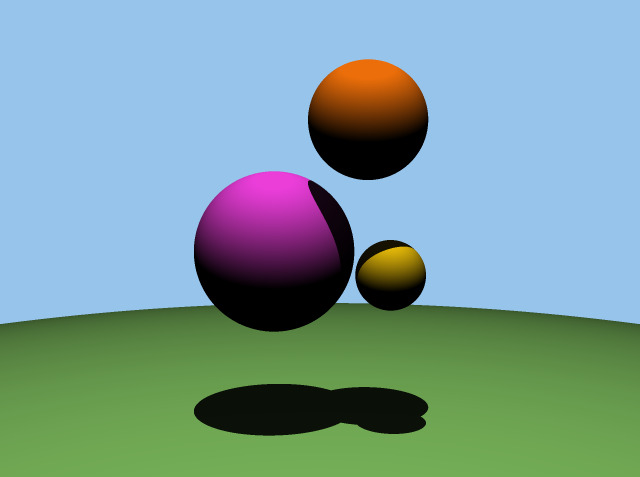
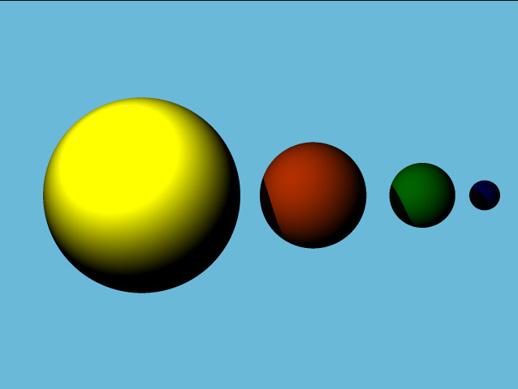
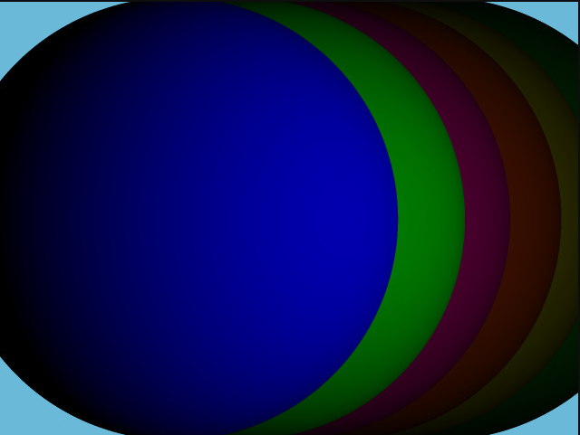

# 3D-Rendering-Engine

A lightweight rendering engine implemented in C that transforms text-defined scene data into rasterized images in PPM format. It handles parsing input, constructing scene representations, and producing pixel-level output without relying on external graphics libraries.

